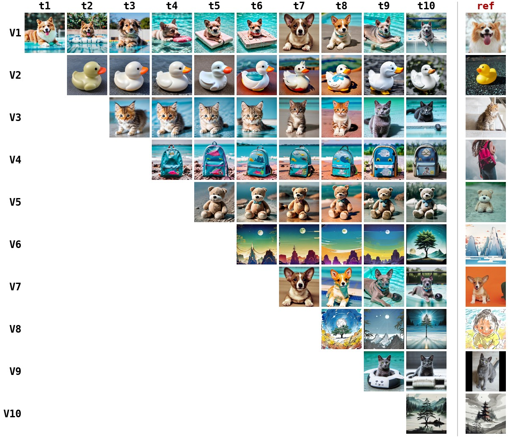

# ContinualHyper

A **LoRA-hypernetwork for continual learning in diffusion models** — concepts are personalized
**one after another** (the CIDM / CIFC concept-incremental setting), and a single shared
hypernetwork generates the per-concept adapter.

A text prompt is encoded by SD-1.5's CLIP text encoder; its **`pooler_output`** (one 768-d
vector) conditions per-layer MLP **heads** that emit a **LoRA** on the UNet cross-attention
(`attn2.to_k`, `attn2.to_v`). The LoRA is **timestep-independent** (one LoRA per prompt, reused
at every denoising step). There are **no learned tokens** and no reference image at inference —
the only conditioning is the CLIP-encoded prompt, with a rare identifier per concept
(e.g. `"a photo of V1 dog"`). The backbone (UNet/VAE/CLIP) is frozen; only the heads train.

This is a distilled, self-contained re-implementation of the UnHype LoRA-hypernetwork idea,
adapted to continual personalization and evaluated faithfully against the CIDM/CIFC benchmark.

## Roadmap

1. **Baseline — no regularization (this repo):** train the hypernetwork sequentially with no
   protection of its weights → **catastrophic forgetting** (the intended reference point).
2. **Continual-learning regularization:** von Oswald et al., *Continual learning with
   hypernetworks* ([arXiv:1906.00695](https://arxiv.org/abs/1906.00695)) — anchor the
   hypernetwork's output on old concepts so their LoRAs stay stable while new ones are learned.
3. **Composition:** TARA, *Token-Aware LoRA for Composable Personalization*
   ([arXiv:2508.08812](https://arxiv.org/abs/2508.08812)) — token masking + spatial alignment for
   clean multi-concept generation.

## Method at a glance

```
prompt ──CLIP──> pooler_output (768-d) ──> per-layer heads ──> LoRA (x_L, x_R) on attn2.to_k/to_v
                                                                 │
              frozen SD-1.5 UNet  ◀── applied: out + (x @ x_L) @ x_R  (LoRA ON for the CFG cond pass,
                                                                       OFF for the uncond pass)
```

Concepts are learned sequentially; the hypernetwork weights persist across tasks. With no
regularization (this repo), training task *k* drifts the mapping for tasks `< k` → forgetting.

## Repository layout

```
src/sd_loader.py     frozen SD-1.5 (diffusers); encode_text -> (last_hidden, pooler_output, mask)
src/injection.py     CachedLoRALinear wrappers on attn2.to_k/to_v;  out + (x @ x_L) @ x_R
src/hyper_head.py    per-layer head: clip_pooled -> (alpha, x_L, x_R); right branch zero-init
src/manager.py       ContinualHyperManager + build_hyper; caches the per-layer LoRA from a prompt
src/sampling.py      CFG sampling; LoRA computed once per prompt, reused every step
src/losses.py        reconstruction_loss (epsilon-prediction MSE)
src/data.py          ConceptDataset: CIDM per-image captions, class word -> "V<k> <class>"
src/train_cl.py      sequential continual-learning trainer (no regularization) + optional wandb
src/infer.py         prompt -> sampled images
src/gen_cifc.py      generate the CIDM eval set (recontextualization prompts) / forgetting matrix
src/cifc_metrics.py  CLIP-T / CLIP-I / DINO (CIDM evaluate.py formulas) -> Average + Forgetting
src/eval.py          standalone CLIP/DINO scorers
scripts/make_forgetting_grid.py   render the forgetting matrix as a single image
configs/cl_unhype.yaml            the 10-concept CIFC task sequence + hyper/training config
```

Each step below is a plain `python -m ...` call (single CUDA GPU); there are no cluster/scheduler
assumptions.

## Setup

```bash
uv venv && source .venv/bin/activate
uv pip install -r requirements.txt       # or: uv pip install -e .
```

A CUDA GPU is recommended for training/sampling (fp32 SD-1.5 fits in ~16 GB). SD-1.5 is
downloaded automatically by `diffusers` on first use.

**Data — the CIDM/CIFC benchmark** (images, per-image captions, eval prompts). Clone it into
`data/CIFC/` (this repo expects `data/CIFC/datasets/{images,caption,evaluation_prompts}/`):

```bash
git clone https://github.com/JiahuaDong/CIFC data/CIFC
```

## Run

```bash
# 1) train the 10 concepts sequentially (no regularization baseline)
python -m src.train_cl --config configs/cl_unhype.yaml

# 2) sample a learned concept
python -m src.infer --config configs/cl_unhype.yaml --ckpt outputs/cl_unhype/hyper.pt \
    --prompt "a photo of V1 dog" --out outputs/cl_unhype/infer --num_images 4

# 3) CIDM evaluation: generate the forgetting matrix, then compute metrics
python -m src.gen_cifc     --config configs/cl_unhype.yaml --ckpt_dir outputs/cl_unhype/ckpts \
    --out_root outputs/cl_unhype/cifc_eval --num_samples 4        # add --final_only to skip the matrix
python -m src.cifc_metrics --config configs/cl_unhype.yaml --eval_root outputs/cl_unhype/cifc_eval

# 4) render the forgetting grid (rows = concepts, columns = model after each task, + reference)
python scripts/make_forgetting_grid.py --config configs/cl_unhype.yaml \
    --out outputs/cl_unhype/forgetting_grid.jpg
```

`train_cl` writes per-task checkpoints to `outputs/cl_unhype/ckpts/`, diagnostic samples to
`fresh/` `forgetting/` `final/`, and the final `hyper.pt`. `configs/`, `outputs/`, `data/`,
`.cache/` are run-local. Metrics models (CLIP ViT-B/32, DINO ViT-S/16) download on first eval.

## Results — Step 1 baseline (no regularization)

CIDM-faithful evaluation on the 10-task CIFC sequence (CLIP-T / CLIP-I are CIDM's TA / IA):

| | CLIP-T | CLIP-I | DINO |
|---|---|---|---|
| Just-learned (diagonal of the matrix) | 0.723 | **0.790** | 0.604 |
| After full sequence (final) | 0.732 | 0.729 | 0.423 |
| **Forgetting** (mean peak − final) | – | +0.067 | **+0.202** |

The per-concept fidelity *when a concept is first learned* already matches CIDM's reported final
numbers (their CIDM IA ≈ 0.78), so per-concept learning is not the bottleneck — **the gap is
forgetting**, which is exactly what Step 2 targets. The forgetting is visible in
`forgetting_grid.jpg` (each row degrades left→right as later tasks overwrite the shared weights):



## Reusing this repo (for a different approach)

If you are building a different continual / compositional personalization method, these pieces are
self-contained and method-agnostic:

- **`sd_loader.py` + `injection.py`** — frozen SD-1.5 with application-only LoRA wrappers; swap in
  any weight generator by setting `unet.hyper` to your own object exposing
  `get_cached_lora(layer_name) -> (x_L, x_R)` and `lora_enabled`.
- **`gen_cifc.py` + `cifc_metrics.py` + `make_forgetting_grid.py`** — a faithful CIDM/CIFC
  evaluation harness (recontextualization prompts, CLIP-T/CLIP-I/DINO, full forgetting matrix,
  visualization) that works on *any* checkpoint sequence, independent of how the model is trained.
- **`train_cl.py`** — a minimal sequential continual-learning loop (per-task checkpoints, diagnostic
  generations) to fork for your own objective/regularizer.

## References

- UnHype LoRA-hypernetwork (idea this is distilled from)
- CIDM / CIFC — *How to Continually Adapt Text-to-Image Diffusion Models for Flexible
  Customization?* ([arXiv:2410.17594](https://arxiv.org/abs/2410.17594), benchmark + eval code)
- von Oswald et al. — *Continual learning with hypernetworks* ([arXiv:1906.00695](https://arxiv.org/abs/1906.00695))
- TARA — *Token-Aware LoRA for Composable Personalization* ([arXiv:2508.08812](https://arxiv.org/abs/2508.08812))
