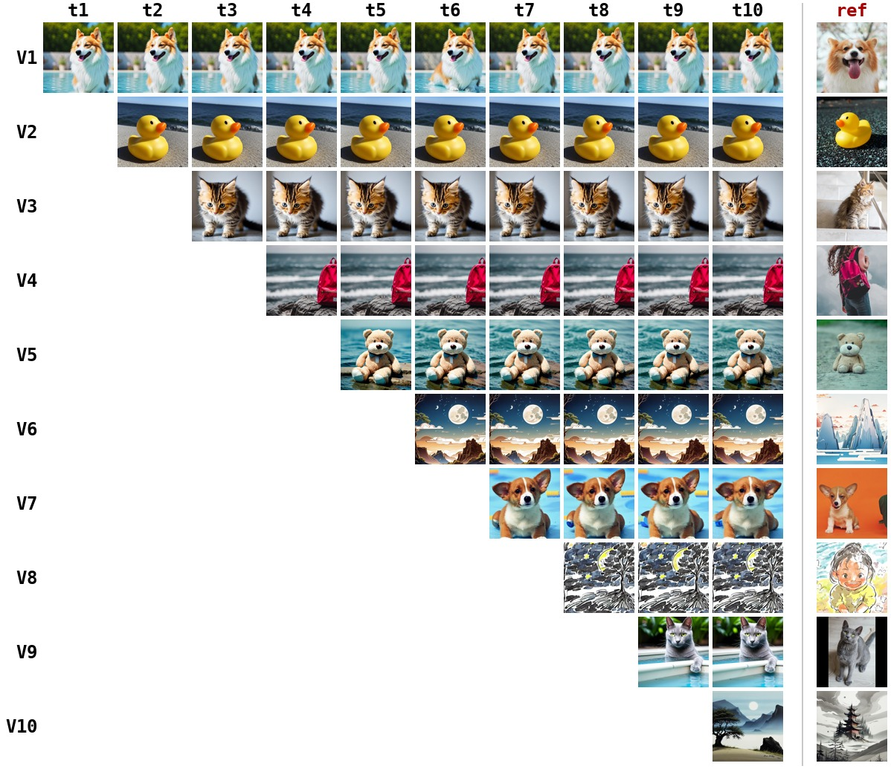
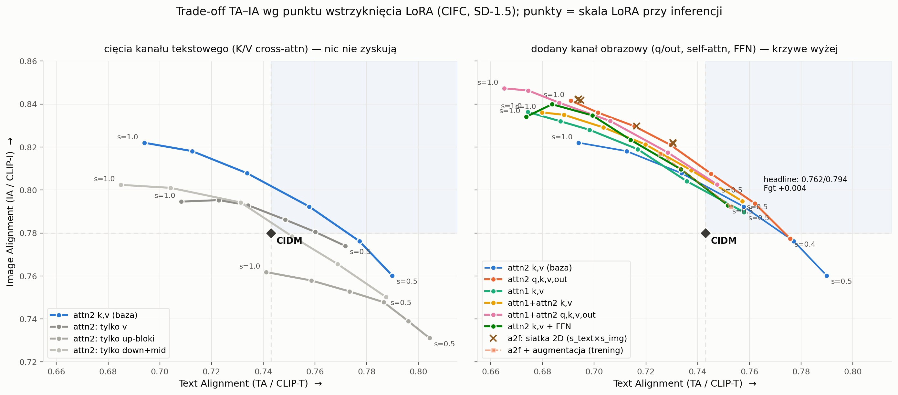
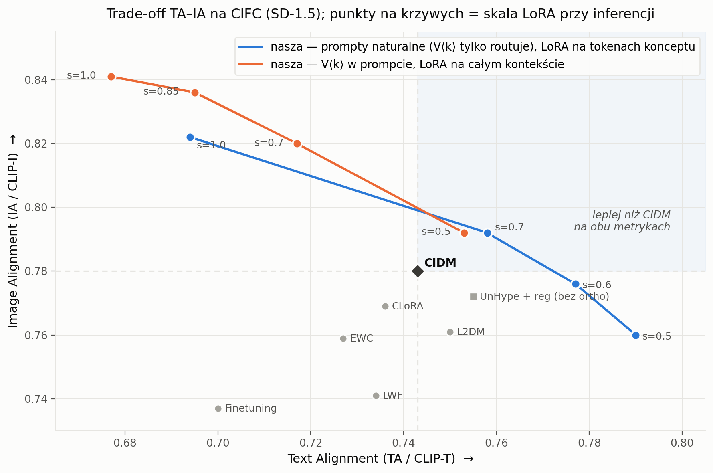
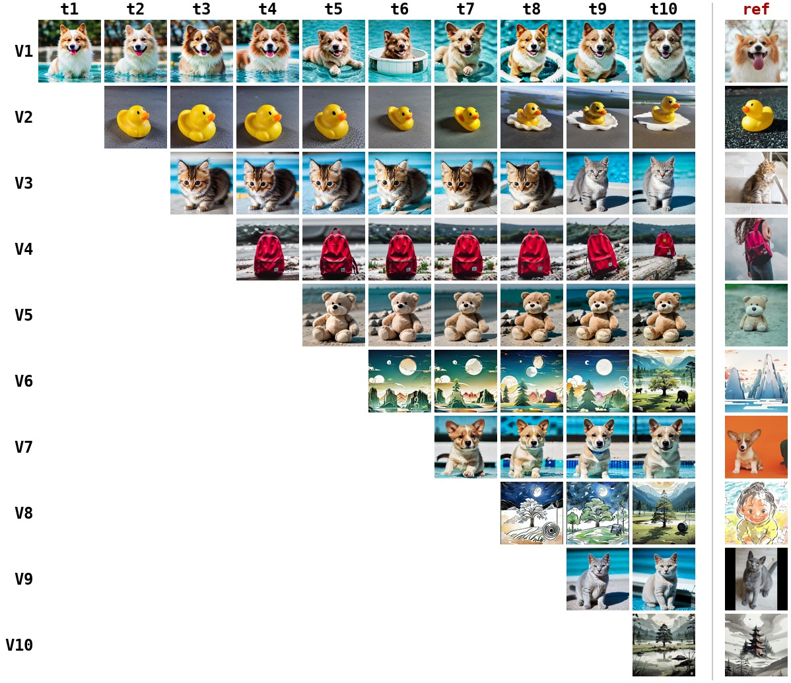

# ContinualHyper

A **LoRA-hypernetwork for continual learning in diffusion models** — concepts are personalized
**one after another** (the CIDM / CIFC concept-incremental setting), and a single shared
hypernetwork generates the per-concept adapter.

The final method is deliberately small:

- **Task keys.** Each task gets a **constant conditioning key**: a frozen vector, Gram-Schmidt
  orthogonalized against the keys of all previous tasks. The key's content is irrelevant
  (ablated); what matters is that it is *fixed* and *orthogonal* — same-class concepts
  (two different cats) get structurally separated inputs, so they cannot collide.
- **Hypernetwork.** Per-layer MLP heads map the task key to a **LoRA** on the UNet attention
  projections (`attn2.to_q/to_k/to_v/to_out`). The LoRA is timestep-independent (computed once,
  reused every denoising step). The backbone (UNet/VAE/CLIP) is frozen; only the heads train.
- **Natural prompts.** The identifier in a user prompt (`"a photo of V1 dog"`) is pure **routing
  syntax**: it selects the task key and is stripped before text encoding — the diffusion model
  only ever sees natural language (`"a photo of dog"`). Identity lives entirely in the key.
- **Continual learning.** Old keys are per-task and frozen (nothing to forget); the shared heads
  are protected with von Oswald output regularization (arXiv:1906.00695) anchored *exactly* at
  the task keys — the same points used at inference.
- **One checkpoint, a whole trade-off curve.** LoRA strength at inference (`--lora_scale`) tunes
  fidelity ↔ prompt-following post-hoc; the headline operating point is `0.5`.

This is a distilled, self-contained re-implementation of the UnHype LoRA-hypernetwork idea,
adapted to continual personalization and evaluated faithfully against the CIDM/CIFC benchmark.

## Headline result

Final model after the full 10-task CIFC sequence (CLIP-T / CLIP-I are CIDM's TA / IA):

| | CLIP-T (TA) | CLIP-I (IA) | DINO |
|---|---|---|---|
| just-learned (matrix diagonal) | 0.761 | 0.794 | 0.618 |
| **after full sequence (final)** | **0.762** | **0.794** | **0.615** |
| forgetting (peak − final) | — | +0.001 | +0.004 |
| CIDM (paper, SD-1.5) | 0.743 | 0.780 | — |

**Both reported CIDM metrics are exceeded (+0.019 TA / +0.014 IA), and final ≈ just-learned on
all three metrics** — after ten sequential tasks the model generates every concept as if it had
just been trained on it. Same-class concepts are cleanly separated: two different cats are
produced from the *identical* prompt `"a photo of cat"`, distinguished only by their task key.



## Where to inject the LoRA (hookpoint ablation)

A 9-variant × 6-scale grid over injection points shows a clean mechanism: every variant that
injects into **image-side projections** (`attn2.to_q/to_out`, self-attention, FFN) lies *above*
the text-channel baseline curve; every *cut* of the text channel (`to_v`-only, up-blocks-only,
down+mid-only) lies below it. Instance identity is injected more cheaply through the image side,
where it does not compete with the prompt's text channel — `attn2` with all four projections is
the sweet spot.



The TA–IA trade-off itself is a robust property of the frozen-backbone + LoRA class: training
length, augmentation, rank, attention masks/constraints and per-channel scales all move points
*along* the curves, not off them (early stopping ≈ inference-time scaling, only less flexible).
Axis records from one training family: TA 0.804, IA 0.847, DINO 0.687 — the operating point is a
free, post-hoc choice.



## Repository layout

```
src/sd_loader.py     frozen SD-1.5 (diffusers); encode_text -> (last_hidden, pooler_output, mask)
src/injection.py     CachedLoRALinear wrappers; block-scoped target patterns ("up_blocks*attn2.to_k")
src/hyper_head.py    per-layer head: task key -> (alpha, x_L, x_R); right branch zero-init
src/manager.py       ContinualHyperManager: constant GS task keys, LoRA cache, inference scale (map)
src/tokens.py        token utilities (learned-identifier baseline, token-span masks)
src/sampling.py      CFG sampling; LoRA computed once per prompt, reused every step
src/losses.py        reconstruction_loss (epsilon-prediction MSE)
src/data.py          ConceptDataset: CIDM per-image captions; optional crop/flip augmentation
src/train_cl.py      sequential CL trainer: task keys + von Oswald reg + per-task checkpoints
src/infer.py         prompt -> image; parses the V<k> routing identifier and strips it
src/gen_cifc.py      CIDM eval set / forgetting matrix; --lora_scale, --only_tasks sharding
src/cifc_metrics.py  CLIP-T / CLIP-I / DINO (exact CIDM evaluate.py formulas)
scripts/make_forgetting_grid.py   render a forgetting matrix as one image
scripts/plot_hookpoints.py        the hookpoint-ablation figure (from assets/hookpoint_grid_points.json)
scripts/plot_tradeoff.py          the trade-off-vs-CIDM figure
configs/cl_noid_a2full.yaml       THE final method config (task keys + routing + attn2 q,k,v,out)
configs/cl_*.yaml                 ablation configs (hookpoints, steps, augmentation, rank, tokens)
```

Each step below is a plain `python -m ...` call (single CUDA GPU); there are no cluster/scheduler
assumptions.

## Setup

```bash
uv venv && source .venv/bin/activate
uv pip install -r requirements.txt       # or: uv pip install -e .
```

A CUDA GPU is recommended for training/sampling (fp32 SD-1.5 fits in ~16 GB). SD-1.5 is
downloaded automatically by `diffusers` on first use.

**Data — the CIDM/CIFC benchmark** (images, per-image captions, eval prompts). Clone it into
`data/CIFC/` (this repo expects `data/CIFC/datasets/{images,caption,evaluation_prompts}/`):

```bash
git clone https://github.com/JiahuaDong/CIFC data/CIFC
```

## Run

```bash
# 1) train the 10 concepts sequentially (final method)
python -m src.train_cl --config configs/cl_noid_a2full.yaml

# 2) sample a learned concept ("V1" routes to task 1 and is stripped from the prompt)
python -m src.infer --config configs/cl_noid_a2full.yaml --ckpt outputs/cl_noidA2F_b100/hyper.pt \
    --prompt "a photo of V1 dog" --out outputs/infer --num_images 4

# 3) CIDM evaluation at the headline operating point (full forgetting matrix + metrics)
python -m src.gen_cifc     --config configs/cl_noid_a2full.yaml --ckpt_dir outputs/cl_noidA2F_b100/ckpts \
    --out_root outputs/cl_noidA2F_b100/cifc_eval --num_samples 4 --lora_scale 0.5
python -m src.cifc_metrics --config configs/cl_noid_a2full.yaml --eval_root outputs/cl_noidA2F_b100/cifc_eval

# 4) render the forgetting grid / the paper figures
python scripts/make_forgetting_grid.py --config configs/cl_noid_a2full.yaml \
    --eval_root outputs/cl_noidA2F_b100/cifc_eval --out outputs/forgetting_grid.jpg
python scripts/plot_hookpoints.py && python scripts/plot_tradeoff.py
```

`gen_cifc` shards across GPUs with `--only_tasks "9,0"` etc.; `--final_only` evaluates just the
final checkpoint. Metrics models (CLIP ViT-B/32, DINO ViT-S/16) download on first eval.

## How we got here (the result trail)

1. **No regularization (baseline):** catastrophic forgetting — final DINO 0.448, forgetting
   +0.204 (the corgi turns into a generic grey dog).
   
2. **von Oswald output regularization** (β sweep, knee at β=100): forgetting +0.069, final
   CLIP-I 0.772 — within 0.01 of CIDM, but same-class concepts still collide (raw pooled-CLIP
   conditioning of "V3 cat" vs "V9 cat" has cosine 0.79 — the hypernet cannot separate them).
   
3. **Constant orthogonal task keys** fix same-class collapse *structurally* (dog2's just-learned
   DINO jumps 0.605 → 0.86) and cut forgetting to ~0. A key lesson along the way: the
   conditioning must be **identical in training and inference** — orthogonalizing each prompt's
   embedding separately removes exactly the shared component that lets training captions
   generalize to test prompts, and same-class concepts break.
4. **Routing:** with identity carried by the key, prompts become pure natural language; the
   `V<k>` identifier only routes. Learned-token conditioning (textual-inversion style) is kept
   as a baseline — it matches, but never beats, the key-based variant.
5. **Hookpoint ablation** finds the image-side channel; `attn2` with q,k,v,out at inference
   scale 0.5 is the final operating point (table above).

## Reusing this repo (for a different approach)

If you are building a different continual / compositional personalization method, these pieces are
self-contained and method-agnostic:

- **`sd_loader.py` + `injection.py`** — frozen SD-1.5 with application-only LoRA wrappers
  (block-scoped target patterns); swap in any weight generator by setting `unet.hyper` to your
  own object exposing `get_cached_lora(layer_name) -> (x_L, x_R)` and `lora_enabled`.
- **`gen_cifc.py` + `cifc_metrics.py` + `make_forgetting_grid.py`** — a faithful CIDM/CIFC
  evaluation harness (recontextualization prompts, CLIP-T/CLIP-I/DINO, full forgetting matrix,
  GPU sharding, visualization) that works on *any* checkpoint sequence.
- **`train_cl.py`** — a sequential continual-learning loop (per-task checkpoints, diagnostic
  generations, optional regularizer/augmentation) to fork for your own objective.

## References

- UnHype LoRA-hypernetwork (idea this is distilled from)
- CIDM / CIFC — *How to Continually Adapt Text-to-Image Diffusion Models for Flexible
  Customization?* ([arXiv:2410.17594](https://arxiv.org/abs/2410.17594), benchmark + eval code)
- von Oswald et al. — *Continual learning with hypernetworks* ([arXiv:1906.00695](https://arxiv.org/abs/1906.00695))
- TARA — *Token-Aware LoRA for Composable Personalization* ([arXiv:2508.08812](https://arxiv.org/abs/2508.08812))
